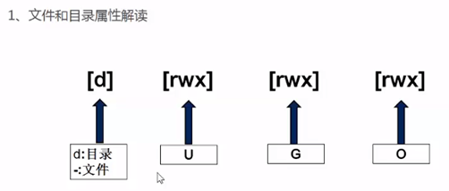
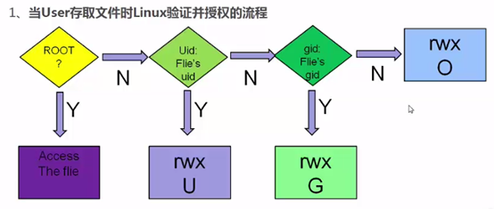
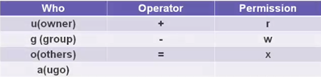
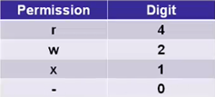
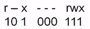
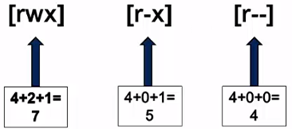
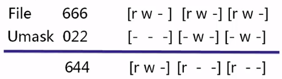
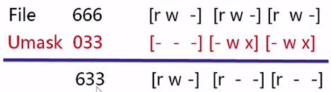
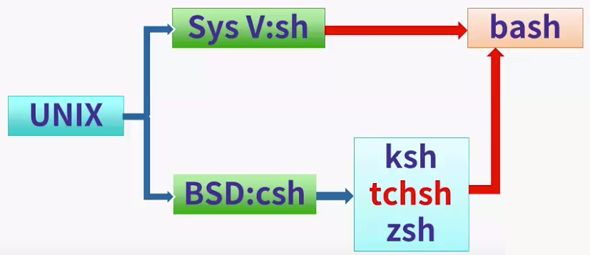

# Linux 文件和目录管理

## 文件系统架构

1. Linux文件系统具有层级性
   - 文件或者目录起始于根目录 `/` 成为树状结构
   - 最顶层由 `/` 开始
2. 文件和目录名区分大小写
3. 路径通过 `/` 分隔开
4. ".." 表示上层目录
5. "." 表示当前目录
6. 隐藏目录或者文件名以 "." 开始

## 重要目录说明

| 目录                                 | 说明                                                         |
| ------------------------------------ | ------------------------------------------------------------ |
| `/home`                              | 用户目录，root用户的home目录是 /root，普通用户的目录是 /home/userx |
| `/bin`                               | 常用的可执行文件，/bin、/usr/bin、/sbin等                    |
| `/media`、`/mnt`                     | 外部设备 mountpoint，当检测到设备接入会自动产生挂载点        |
| `/etc`                               | 系统的配置文件                                               |
| `/tmp`                               | 临时文件                                                     |
| `/boot`                              | 系统内核和开机必要文件                                       |
| `/dev`                               | 系统所有的设备文件                                           |
| `/usr`                               | unix system resource，保存程序的相关文件                     |
| `/lost+found`                        | 每个分区都会自动创建，当文件系统出错时，用来存放丢失的文件   |
| `/var`、`/srv`                       | 保存系统运行时的一些用户数据                                 |
| ``/proc`                             | 虚拟的文件目录，数据都是在内存中的，不占用硬盘空间           |
| `/lib`、`/usr/lib`、`/usr/local/lib` | 类库                                                         |

## 目录和文件的命名规则

1.  不超过255个字符
2.  区分大小写
3.  除了`/`外，所有字符都合法
   1. 避免文件名首字符使用`+-.`等
   2. 避免使用空格、制表符和`@#$%[]()`等
   3. 最好使用有意义的名称来命名

## ls操作指令

`ls [options] [file_or_dirs]`

```
ls，列出当前目录内容
ls / ，显示根目录的内容
ls -a ，显示隐藏文件
ls -ld ，显示目录本身的属性
```

`ls -a /user/bin >list`

查看/user/bin下的所有文件，并将文件信息定向输出到list文件中

## 文件和目录操作

1. 相对路径和绝对路径
   - 绝对路径必须是/开头
   - 相对路径一般比较短
2. 切换目录
   - cd、pwd
   -  cd.. ，cd~，cd -
3. 复制文件和目录，cp

   - cp [options] file destination
4. 移动和重命名文件文件和目录，mv

   - 移动操作类似于cp
5. 删除文件和目录，rm
   - rm [options] filenames
   - -i，交互式
   - -r，递归删除
   - -f，force
6. 新建文件和目录，touch，mkdir
   - cd、pwd
   - cd.. ，cd ~，cd –
7. 确定文件格式
   - 打开文件前确定格式使用不用的程序打开   
   - File [options] filenames
8. cat

   - cat [options] filenames
9. 分页查看文本文件，less
   - less [options] filenames
   - 使用pgUp、pgDown翻页

# Linux用户、群组和权限

## Linux安全性模型

1. Linux使用User和Group控制使用者对文件的存取权限
2. 用户使用账号和口令登陆Linux
3. 每个文件都有owner，并且owner属于某个Group
4. 每个程序都有owner和Group

## 用户概述

1. 每个用户都有一个唯一的User ID
2. User的信息存储在/etc/passwd中
   - 存储用户名和home目录等信息
   - /etc/shadow
3. 每个User都有一个home目录
4. User未经授权将禁止读写或者执行其他User的文件
5. root用户解读
   - 超级管理员账号，具有至高无上的权限
   - 一般那不要随便用户root登录并操作系统
   - 添加用户，在root用户下 adduser [username]

## 用户群组概述

1. 每个User属于一个Group，就有唯一的标识符gid
2. Group信息存储与/etc/group中
   - gid、成员等
   - /etc/gshadow
3. 系统会为每个User关联一个和User同名的Group
   - 每个User至少存在于自己同名的Group中
   - User也可以加入其他的Group
4. 在同一个Group中的成员可以共享其他成员的文件

## Linux权限种类

1. 可读权限，用r表示（read）

   可以读取文件或者列出目录的内容（ls）

2. 可写权限，用w表示（write）

   可以写、删除文件或者目录

3. 可执行权限，用x表示（execute）

   - 可以执行可执行文件
   - 可以进入目录并使用cd切换进入目录

4. 没有任何权限，用-表示

## 文件和目录权限解读



U代表User，表示用户权限，文件或目录的所有者的权限；

G代表Group，表示群组权限，文件或目录的所所属的用户群组的权限；

O代表Others，其他用户的权限。

## 权限验证流程



## 权限设置

1. 字符表示法

   1. `chmod [-R] mode file`

      `-R` 代表子目录和子文件同步修改权限

   2. 模式类别

      

      `chmod u-w bin` （去掉owner对bin目录的写的权限）

      `chmod go=r file`（把group和others的权限设置成只读）

2. 数字表示法

   用一组三位数来表示，最高位代表owner权限，中间位代表group权限，最低位代表others权限

   

   

   

3. 图形化界面设置

# Linux 用户和群组进阶

## 用户的主要群组和次要群组

1. 主要群组

   每个文件都必须有一个组所有者，因此必须有一个与每个用户相关的默认组，这个默认组成为新建文件的组的所有者，被称作用户的主要群组。用户的主要群组在passwd文件的第四个字段中定义。

   主要群组，主要在新建文件时起作用。

2. 次要群组

   除了主要群组，用户也可以根据需要再隶属于其他群组，并且可以属于多个次要群组，这些组被称为次要群众，在group文件中的第四字段中定义。

3. 可以用 groups 命令查看用户的主要群组和次要群组。

## 用户的管理

1. useradd [-u UID] [-g 初始群组] [-G 次要群组] [-mM] [-c 说明] [-d 家目录] [-s shell] username

   ```
   -u：制定一个特殊的UID给该账号
   -g：指定一个主要群组的名称，会修改passwd文件
   -G：制定次要群组的名称，会修改group文件
   -M：强制不要创建用户家目录，系统账号默认
   -m：强制建立用户家目录，一般账号默认
   -c：passwd文件的第五个字段的说明文字
   -d：只当用户的家目录位置，不要使用默认的值
   -s：制定默认的shell，如果没有指定则默认是/bin/bash
   ```

2. 修改用户信息usermod [-cdegGlsuLU] username

   ```
   -c：该账号的说明文字
   -d：账号的家目录
   -e：指定用户账号禁用的日期，格式YY-MM-DD
   -G：修改次要群组的名称，会修改group文件
   -g：修改主要群组名称
   -a：与 -G合用，可增加次要群组，usermode -aG 次要群组名 用户名
   -l：将当前账号的名称重命名为指定名称
   -u：修改UID
   -L：暂时将用户的密码冻结无法登录，其实就是在/etc/shadow用户的密码前加!
   -U：解冻账号，其实是删除/etc/shadow的密码前的!字符
   ```

3. 删除用户userdel [-r] username

   ```
   -r：连同用户的家目录一起删除
   ```

4. passwd [username]：修改密码

## 用户信息的检查

1. `finger [-s] username`，查阅用户相关信息

   ```
   -s：仅仅列出用户的账号、全名、登录时间等
   ```

2. `id`，可以查阅某人或自己相关的UID、GID信息

3. `whoami`

4. `who&w`，类似于finger

5. `users`，显示当前使用用户的用户名


## 用户群组管理

1. `group`，查看当前用户的群组用户群组管理

2. `groupadd [-g gid] [-r] 组名`，添加群组

   ```
   -g：后面按特定的GID，用来指定GID
   -r：建立系统群组
   ```

3. `groupmod [-g gid] [-n groupname] 群组名`，修改群组

   ```
   -g：修改既有的GID数字
   -n：修改既有的组名
   ```

4. `groupdel [groupname]`，删除群组

## 默认权限的控制

1. 内核级别，文件的默认权限是666

2. 内核级别，目录的默认权限是777

3. 通过umask来阻止一些权限，从而产生最终的权限

4. 非管理账号的umask为0002

5. root的umask为0022

6. umask作用原理

   

   内核级别的默认权限经过umask的遮罩保留下来的是最终权限

   可以通过umask 0002命令更改umask值

7. 使用减法计算是错误的

   

   umask类似与子网掩码，上图中，最终权限是644，并非减group 法得到的633

# 文件的压缩与打包

## 关于文件压缩和打包

1. 文件压缩

   通过压缩算法将文件的体积缩小，同时会将多个文件合并至一起方便交换传输。

2. 文件打包

   将多个文件或整个目录合并成一个文件，用来进行文件的备份、分发、传输等。

3. Linux支持的压缩格式
   - `*.Z`，compress程序压缩文件
   - `*.gz`，gzip程序压缩文件
   - `*.bz2`，bzip2程序压缩文件
   - `*tar`，tar程序打包文件，并未压缩
   - `*.tar.gz`，tar打包的文件，使用gzip压缩
   - `*.tar.bz2`，tar打包的文件，使用bzip2压缩

## Linux文件压缩指令

1. `gzip [-cdtv#] 文件名称`

   ```
   扩展名为*.gz
   -c：将压缩与解压缩的结果送到标准输出，将压缩数据输出到屏幕上，保留原文件
   	gzip -c list >list.gz
   	压缩数据不输出到屏幕上，而是重定向到list.gz文件，
   	也就是输出到磁盘上，并且原文件会保留
   -d：解压缩的参数，执行解压缩操作
   -t：进行文件的一致性校验看是否损坏
   -v：显示和原文件相比的压缩比
   -#：压缩等级，-1最快，-9最慢，默认是6
   ```

2. `bzip2 [-cdkzv#] 文件名称`
   
   ```
   扩展名为*.bz2
   -c：将压缩与解压缩的结果送到标准输出
   -d：解压缩的参数，该参数代表执行解压缩操作		
   -k：保留原文件，并不删除原始文件
   -z：压缩的参数，该参数代表执行压缩操作（默认就是这个）
   -v：显示和原文件相比的压缩比
   -#：压缩等级，-1最快，-9最慢，默认是6
   ```


## Linux文件打包指令

1. `tar [-jcv] -f filename.tar.bz2 待压缩的档案或者目录名`

   将某个文件或者目录打包并使用bzip2压缩成一个文件

2. `tar [-jxv] -f filename.tar.bz2 -C 解压缩的目录`

   将压缩文件解压至特定目录

3. 参数解释

   ```
   -c：建立打包文档
   -t：查看打包的文件都有哪些文件名
   -x：解压缩或者解打包文件，和-C搭配使用解压缩至特定目录
   -j：通过bz2支持进行压缩或者解压缩
   -z：使用gzip进行压缩或者解压缩
   -v：将正在处理的文件名显示出来
   -f：紧跟要被处理的文件名，建议单独写一个选项
   ```

4. 最简单那的三个tar指令：其中j参数可换成z参数

   - 压缩：`tar -jcv -f filename.tar.bz2 待压缩的文件或目录`
   - 查询：`tar -jtv -f filename.tar.bz2`
   - 解压缩：`tar -jxv -f filename.tar.bz2 -C 待压缩目录`

# vi编辑器

## vi编辑器简介

1. vi编辑器

   visual interface的简称，是Linux上基本的文本编辑工具，可以执行输出、删除、查找、替换、块操作等众多文本操作，而且用户可以根据自己的需要对其进行定制。

2. vim编辑器

   vi Improved的简写，属于增强版的vi，在vi的基础上增加了很多功能，如代码的关键字加亮等，vim兼容所有的vi指令。

3. 一般常用的修改配置等操作vi就足够了，如果编写代码进行编程，vim适合

## vi编辑器的基础使用

**启动vi**

- vi filename
- 如果文件存在，则打开并显示内容
- 文件不存在，在第一次保存时创建文件

**vi的三种模式**

- 命令模式，可以移动光标，修改、删除、复制、搜索
- 插入模式，通过 `a`、`i`、`o` 进入，可任意修改文件内容
- 扩展模式，通过 `:` 进入，保存、退出、查找替换

**vi编辑器操作**

1. 移动光标

   - `h`，`j`，`k`，`l`，左下上右，或者使用方向键
   - `w` 下一个字符，`b` 上一个字符
   - `(` 上一个句子，`)` 下一个句子
   - `{` 上一个段落，`}` 下一个段落

2. 命令模式下修改、复制、删除等操作

   
   
   上表表示命令模式下对行、字符、单词的修改、删除、复制的操作。其中对单词的操作比较特殊，操作的对象是从单词从光标处到单词的结尾处，所以如果要对整个单词进行操作光标要放到的单词开头处。

3. 撤销操作

   - `u`，撤销最近的一次修改，undo
   - `ctrl+r`，取消最近的一次撤销，redo
   - `U`，撤销所有的修改

4. 查找操作

   - `/text`，向后搜索
   - `?text`，向前搜索
   - `n`，搜索下一个同样的内容
   - `N`，搜索上一个同样的内容

5. 粘贴操作

   - 用 `p` 粘贴复制、修改或删除的内容
   - 对于行，`p` 粘贴在行上，`P` 粘贴在行下
   - 对于字符，`p` 粘贴在字符右侧，`P` 粘贴在字符左侧 

6.  命令模式下的一些技巧
  
   - `dtc`，删除从光标到c之间的所有字符
   - `rc`，将光标下的字符替换为c
   - `dw`，删除光标处的字符
   - `5dd`，删除5行数据
   - `5yy`，复制5行数据
   - `5x`，删除5个字符
   - `R`，进入替换模式，esc退出

7. 保存、退出，进入扩展模式

   - `:w`，保存
   - `:q`，退出
   - `:wq`，保存退出
   - `:w!`，强制保存
   - `:q!`，强制退出
   - `:wq!`，强制保存退出

## vi编辑器的进阶使用

1. 文件内定位

   - `G`，跳转到文件最后一行
   - `1G`，跳转到文件的第一行
   - `ctrl+d`，向下滚动半屏
   - `ctrl+u`，向上滚动半屏

2. 屏幕定位相关
   `H`，跳转到本屏显示的第一行
   `M`，跳转到本屏显示的中间一行
   `L`，跳转到本屏显示的最后一行
   `z+Enter`，使当前行成为屏幕显示的第一行
   `z-`，使当前行成为屏幕显示的最后一行

3. 查找并批量处理
   - 命令模式下，通过sed来查找
   - 默认对当前进行查找
   - `1,10`，对1到10行进行查找
   - `1,$`，对整个文件查找

   ```
   :s/str1/str2		将当前行中的第一个str1替换为str2
   :s/str1/str2/g		将当前行中的str1全部替换为str2
   :1,10s/str1/str2/g	将1-10行中的str1全部替换为str2
   :1,$s/str1/str2/g	将整个文件中的str1全部替换为str2
   ```

4. 读取和保存
   - `:r file`，将另外一个file的内容读入到当前，插入位置为光标所在行的下一行
   - `1,20 w file`，将1-20行的内容写入到一个新的file中
   - `1,$ w file`，将整个文件写入一个新的file
   - `1,20 w >>file`，将1-20行数据追加到file中

5. 设置
   - `:set`，显示常用的配置选项
   - `:set all`，显示所有的配置选项
   - `:set number`，设置显示行号

# Linux软件的安装

## 通过源码安装

什么是源码包

- 附带有程序的源代码、configure文件、说明文档的安装包。
- 一般先以tar打包，再以压缩软件压缩，如tar.gz或tarbz2文件。
- 需要自定义参数进行编译安装。

安装过程介绍

1. configure文件
   1. 自定义参数
   2. 配置安装环境，必要性检查
   3. 生成makefile文件
2. make &install
   1. 编译生成二进制文件
   2. 执行安装

完整安装步骤：

1. 使用源码包进行安装的过程1)获取源码安装包，如去官网下载
2. 解压缩，阅读install或readme文件，获取安装说明
3. 根据安装说明安装好该软件依赖的其他软件
4. 建立makefile文件（通过configure检测安装环境，定义必要的参数）
5. 根据生成的makefile文件，执行make指令进行编译操作
6. 根据makefile中要install的内容，将上步骤中编译好的二进制文件安装到系统中

以安装memcache为例

```shell
# 下载源码包
$ wget http://memcached.org/files/memcached-1.4.22.tar.gz
# 解压缩
$ tar -zxvf memcached-1.4.22.tar.gz
$ cd memcached-1.4.22
# 执行configure检查，如果检查通过会生成makefile文件
$ ./configure
$ make
$ make install
```

参考：[安装过程视频](https://www.jikexueyuan.com/course/727.html)

## RPM、SRPM、YUM概述

**RPM**

- RedHat Package Manager的简称，RedHat包管理器。
- 以数据库记录的方式将软件安装到Linux。
- 软件包事先编译好并且打包成RPM机制的文件，类似于Windows的安装程序。
- 软件信息记录在本地数据库，方便査询、升级、卸载。
- 不允许自定义参数和设置，限制较多。

**SRPM**

- Source RPM，附带源代码的RPM包，扩展名以src.rpm命名。
- 不可以直接安装，需要通过编辑后再安装。
- 可以修改参数文件自定义配置项。
- 和RPM比较类似。

**YUM**

- Yellow dog Updater Modified的简称，基于RPM包管理。
- 能够从指定的服务器自动下载RPM包并且安装，可以自动处理依赖性关系，并且一次安装所有依赖的软体包，无须繁琐地一次次下载、安装。
- 使用简单、方便。

## RPM的使用

默认安装路径

- /etc：配置文件所在目录，如/etc/my.cnf、/etc/crontab等
- /usr/bin:一些可执行文件
- /usr/lib：程序使用的函数库
- /usr/share/doc软件使用手册与说明
- /usr/share/man:man page文件

RPM安装

`rpm [-ivh] rpm1 rpm2`，安装rpm1/rpm2并显示进度和详情

- --nodeps：忽略依赖问题执意安装
- --replacefiles：对于已经安装过的某个文件覆盖安装
- --replacepkqs：已经安装过的软件重新安装
- --test：测试软件能否被正确安装，rpm -ivh xxx --test
- --justdb：RPM数据库损坏或者产生错误时更新数据库信息
- --nosignature：忽略数字签名的检查
- --prefix：改变软件的默认安装路径
- --noscripts：禁止RPM执行一些后置指令，如一些初始化的指令

RPM升级

- -Uvh：如果软件安装过则更新，若没安装过直接安装
- -Fvh：只有该软件安装过才会升级，否则不予升级

RPM查询

- -q：只查询软件是否安装
- -qa：列出本机安装的所有的软件名称，可以通过Igrep来过滤
- -ql：列出该软件所有的文件、所在目录完整名（list)
- -qc：列出该软件所有的配置文件
- -qR：列出该软件依赖的其他软件的文件
- -qf：查询某个文件属于哪个软件所有
- --noscripts：禁止RPM执行一些后置指令，如一些初始化的指令


RPM验证1）-V：查询软件所有被修改过的文件。
2）-Va：列出本机所有可能被修改过的程序文件。
3）-Vp：接文件名，列出该软件中可能被修改的文件。
RPM卸载与数据库重建1)注意要从上往下依次卸载，先卸载不被任何其他软件依赖的软件。2）-e：卸载软件。3）--rebuilddb:重建RPM数据库。

## YUM的使用

查询，`yum [list|info|search|provides|whatprovides] 参数`
- search：查询某个程序的名称或者是描述（yum search mysql）
- list：列出目前yum所管理的所有软件以及版本（-qa)
- info：类似list，查询软件的功能、版本说明（rpm-qai）
- provides：通过文件查询所属软件（rpm-qf)

安装、升级，`yum [instal|update] 程序名称`
- install：安装软件
- update：升级软件，不指定名称则升级整个系统

卸载，`yum [remove] 程序名称`

- remove：卸载。

yum的配置
- `/etc/yum.repos.d/CentOS-Base.repo`
- `yum clean [package|headers|all]`

# Shell

## bash shell概述

bash是Bourne Again Shell的简称，是从unix系统中的sh发展而来，是用户和Linux内核交互的工具，用户头通过bash操作内核完成系统的使用和管理。bash是shell的一种。

**shell的种类**

- /bin/sh（已经被/bin/bash替代）
- /bin/bash（默认的shell）
- /bin/ksh（源自贝尔实验室，兼容bash）
- /bin/tcsh（整合C shell，功能更为强大）
- /bin/csh（已经被tcsh取代）
- /bin/zsh（源自ksh，功能更为强大）

每种shell的功能比较类似，但是语法会稍有不同

**bash的历史和发展**



## bash shell变量

变量是代表一些值的符号：

- 可以通过变量来设置shel或者其他程序
- 变量存在于内存中
- Linux有自定义变量(local)和环境变量（environment)
- 自定义变量和环境变量作用范围不同

可以使用以下指令查看所有变量：

- `set` 可以查看所有变量
- `env` 可以查看环境变量

## bash shell设置方式 

1. 通过自定义变量设置

   - `VARIABLE=value` ，设置变量
   - `unset VARIABLE`，删除变量
   - `echo SVARIABLE`，获取变量值
   - 变量名不能以数字或者特殊字符开头

   常见的变量：

   - HISTFILESIZE:记录历史指令保存的最大值
   - COLUMNS：终端窗口显示的宽度  
   - LINES:终端窗口显示的高度
   - PS1：设置提示符号前面的内容样式（`\d,\h,\t,\u,\w,\!,\$,\l`等）

2. 通过别名（Aliases)设置

   ```shell
   # 设置别名
   $ alias lss='ls -la'
   # 查看所有别名
   $ alias
   # 查看指定别名
   $ alias ll
   # 使用type查看别名描述，-a可省略
   $ type -a ll
   ll is aliased to 'ls -l --color=tty'
   # 删除别名
   $ unalias lss
   ```

3. 通过set指令设置

   - `set`自身查看所有变量值。
   - 设置shell内部的属性值（`set -o noclobber`, `set -o vi`）

4. 通过环境变量设置

   - 自定义变量只能在当前的shel环境中有效
   - 环境变量会在整个主机下的shell环境中生效
   - 使用`$export [variable name]`来设置

   ```shell
   # 设置变量
   $ set KEY=hello
   # 升级为环境变量
   $ export KEY
   ```

   常用变量介绍：

   - HOME：指向当前用户的家目录
   - LANG：应用程序使用何种语言来显示界面
   - PWD：指向用户当前的工作目录路径

   PATH环境变量：

   - 系统预设的环境变量。
   - 执行一些没有指定路径的指令时会去该路径中找。
   - `PATH=$PATH.:` 将隐藏路径设置到PATH中，会带来安全性问题。
   - 可以使用`which`指令来找到某个指令所在的位置。

## shell startup scripts介绍

用户登录或其他非登录动作时会自动执行的一些shell脚本：

- 建立自定义变量或者执行set指令设置shell
- 建立环境变量，设置其他程序
- 使用alias，简化后续的操作
- 登录的时候执行哪些程序
- 分为login和non-login脚本

**login shell：**

- 通过完整的登录流程时运行的shell
- 首先会读取`/etc/profile` (PATH/USER/HOSTNAME/HISTSIZE等)
- 读取 `/etc/profile.d/*.sh` (颜色、语言、指令别名等）
- `~/.bash_profile`、`~/.bash_login`、`~/.profile` (只依次读取其中一个）
- `~/.bash_rc`、`/etc/bashrc`
- `source 脚本文件名`，指令加载脚本的变更

**non-login shell：**

- 不需要登录即可运行的shell，如su和原bash下的新bash动作
- `~/.bash_rc`、`/etc/bashrc`
- 读取`/etc/profile.d/*.sh` (颜色、语言、指令别名等）
- `~/.bash_logout`
  - 在注销用户时会运行该脚本
  - 可以执行备份、缓存和临时文件清理等任务

# 数据流重定向和管道命令

## 相关概念

- 标准输入（stdin）：是指令数据的输入，代码为0，使用或者`<<`，默认是键盘
- 标准输出（stdout）：是指令执行成功返回的结果，代码为1，使用>或者`>>`，默认由屏幕显示
- 标准错误输出（stderr）：是指令执行失败返回的错误信息，代码为2，使用`2>`或者`2>>`，默认是屏幕

```shell
$ ls -la /dev/std*
lrwxrwxrwx 1 root root 15 Apr 11 02:42 /dev/stderr -> /proc/self/fd/2
lrwxrwxrwx 1 root root 15 Apr 11 02:42 /dev/stdin -> /proc/self/fd/0
lrwxrwxrwx 1 root root 15 Apr 11 02:42 /dev/stdout -> /proc/self/fd/1
```

## 数据流重定向

- `<`：指定输入的数据媒介来源
- `1>`：将正确的内容覆盖输出到指定的媒介
- `1>>`：将正确的内容追加到指定的媒介
- `2>`：将错误信息覆盖输出到指定的媒介。
- `2>>`：将错误信息追加输出到指定的媒介

```shell
# 将正确信息导出到success，错误信息导出到error
$ find /root ins 1>success 2>error
$ ls
success error
# 将所有信息
```

多个指令执行的判断方法

- `bash1&&basb2` ，前者执行成功才会执行后者
- `bash1||bash2` ，前者执行完毕且失败才执行后者

## 管道命令

- 命令通过管道符连接
- 能够接收标准输入（stdin)，如tail/more/grep等
- 能够接收来自于前一个指令的数据成为stdin进行处理

**grep指令**，`grep [-cinv] 'key' filename` ，支持正则

```
-c，计算字符出现的个数
-i，忽略大小写进行查找
-n，输出行号
-v，显示没有该字行
--color=auto，关键字高亮显示
```

**sort指令**，`sort [-fbknrtu] filename`

```
-f，忽略大小写
-b，忽略最前面的空格
-M，以月份英文名字排序
-n，使用数字排序
-r，逆向排序；
-t，分隔符，默认是tab分割
-k，以第几列来排序
```

**wc指令**，`wc [-lwm] filename`，统计功能

```
-l。统计行
-w，统计词
-m，统计学符
```

除此之外还有很多命令都是管道命令，如tr/cut/join/paste等

