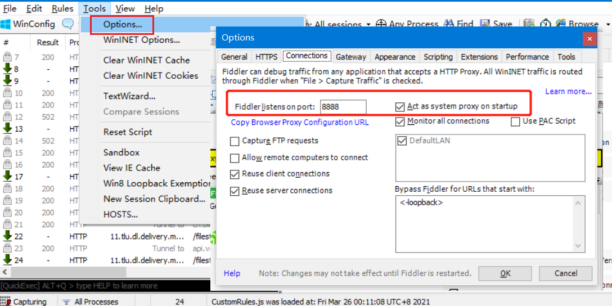
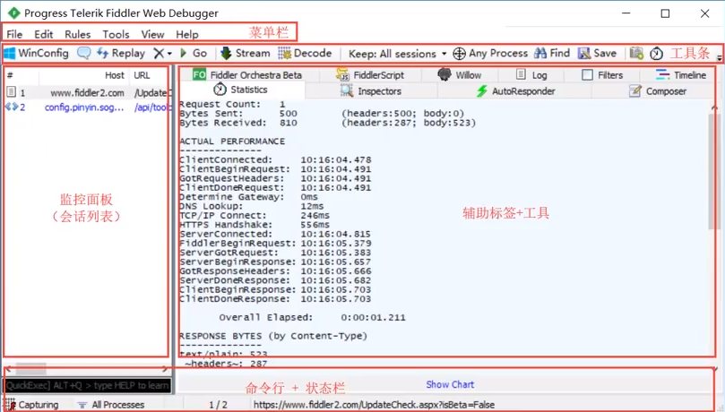

# Fiddler介绍

## Fiddler简介

- Fiddler是位于客户端和服务器端的HTTP代理
- 目前最常用的http抓包工具之一
- 功能非常强大，是web调试的利器
  - 监控浏览器所有的HTTP/HTTPS流量
  - 查看、分析请求内容细节
  - 伪造客户端请求和服务器响应
  - 测试网站的性能
  - 解密HTTPS的web会话
  - 全局、局部断点功能
  - 第三方插件
- 使用场景
  - 接口调试、接口测试、线上环境调试、web性能分析
  - 判断前后端bug、开发环境hosts配置、mock、弱网断网

## Fiddler原理

Fiddler一打开就会设置一个系统代理，是本机的8888端口， Chrome浏览器等会使用该代理，然后Fiddler监听这个端口就可以抓到数据包了。

> 打开Fiddler后，查看windows的 *设置 -> 网络和Internet -> 代理*  可以看到设置的代理信息

##  Fiddler界面介绍

### 菜单栏

- File：重新打开视图、导入导出会话等
- Edit：复制、移除、选择、粘贴、查找会话等
- Rules：隐藏规则、自动断点、脚本设置、弱网测试等
  - ==隐藏图片、建立通道的会话==
  - ==隐藏304响应==
- Tool：Fiddler设置、windows设置、清除IE缓存Cookie、编码解码工具、会话比较、重置脚本、host设置等
- View：展示或隐藏各种视图
- Help：帮助

## 工具栏

- 添加注释
- 

# Fiddler使

## 请求分析

## 请求修改

## 相应修改

## 网络限速

## 断电调试

## 设计请求

## 自动相应

## mock测试

# Https抓包

# App抓包

# 附录

## 快捷键

| 快捷键    | 功能                          |
| --------- | ----------------------------- |
| Shift + R | 重复请求n次（串行的，非并发） |
|           |                               |
|           |                               |
|           |                               |
|           |                               |
|           |                               |
|           |                               |
|           |                               |
|           |                               |
|           |                               |
|           |                               |
|           |                               |
|           |                               |
|           |                               |
|           |                               |
|           |                               |
|           |                               |
|           |                               |
|           |                               |
|           |                               |
|           |                               |
|           |                               |
|           |                               |
|           |                               |
|           |                               |
|           |                               |
|           |                               |
|           |                               |
|           |                               |

